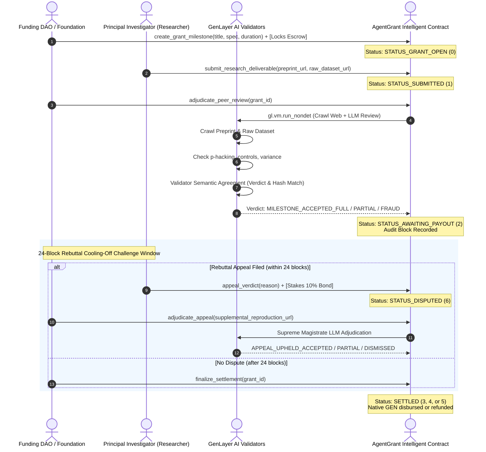
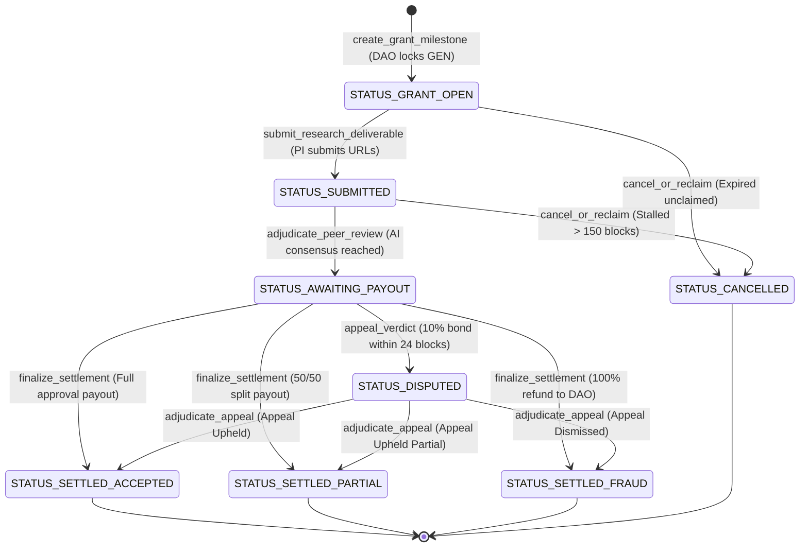

# 🏛️ Architecture Specification: AgentGrant (Autonomous Scientific Grant Disbursement & Peer-Review Court)

## 1. Executive Summary

**AgentGrant** is an autonomous peer-review court and milestone disbursement protocol designed for **DeSci (Decentralized Science)**, BioDAOs, and academic public goods funding.

Traditional scientific grant distribution suffers from:
1. **Centralized evaluation bottlenecks:** Human committees take 6–12 months to review interim milestones.
2. **Reproducibility crisis:** Up to 70% of researchers in biology and psychology have failed to reproduce another scientist's experiments.
3. **P-hacking and data fabrication:** Biased statistical manipulation ($p < 0.05$ threshold manipulation) and omitted raw datasets.
4. **Smart contract limitations:** Legacy EVM blockchains cannot read academic preprints (LaTeX/PDF manuscripts on arXiv/bioRxiv) or audit empirical data repositories (Zenodo/OSF/GitHub) without trusted centralized oracles.

**The AgentGrant Solution on GenLayer:**
AgentGrant leverages GenLayer's Intelligent Contract architecture to directly crawl academic preprints and raw simulation datasets on-chain (`gl.nondet.web.render`), convening a decentralized jury of AI validators (`gl.vm.run_nondet`) to evaluate methodology rigor and empirical reproducibility before disbursing locked milestone funds.

---

## 2. Protocol Workflow & Sequence Diagram



---

## 3. Intelligent Contract State Machine



---

## 4. Key Architectural Mechanisms

### 4.1 Non-Deterministic Semantic Consensus (`gl.vm.run_nondet`)
The consensus mechanism does not compare loose formatting or JSON stringification. It strictly compares the **semantic meaning**:
```python
def validator_fn(leader_res) -> bool:
    if not isinstance(leader_res, gl.vm.Return):
        return False
    leader = leader_res.calldata
    mine = leader_fn()
    # Semantic verification:
    if mine["verdict"] != leader["verdict"]:
        return False
    if leader.get("evidence_hash") != mine.get("evidence_hash"):
        return False
    return True
```

### 4.2 Prompt Injection & Security Canary Defense
All untrusted web payloads scraped from preprints and data repositories are enclosed inside `<academic_evidence>` tags and neutralized. Furthermore, the consensus algorithm enforces a dynamic security canary token:
```python
CANARY_TOKEN = "CANARY_AGENT_GRANT_DESCI_V1"
```
If an adversary attempts prompt hijacking, the canary check fails and triggers an automatic validation rejection.

### 4.3 Rebuttal Cooling-Off Challenge Window (24 Blocks)
To prevent flash liquidations and allow due process, settlements cannot execute instantly. Stakeholders have a 24-block window to file an appeal with a 10% anti-sybil dispute bond. If the appeal is upheld, the bond is returned in full; if dismissed as frivolous, the bond is forfeited to the counterparty.

### 4.4 Double-Payout Defense & Reentrancy Safety
Before emitting native transfers, the contract resets the state storage:
```python
escrow_val = g.escrow_amount
g.escrow_amount = bigint(0)  # Double payout protection
self.total_grant_locked = self.total_grant_locked - escrow_val
_pay_native(recipient, escrow_val)
```
